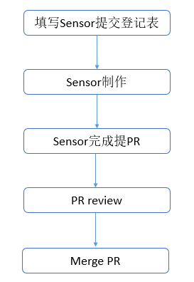
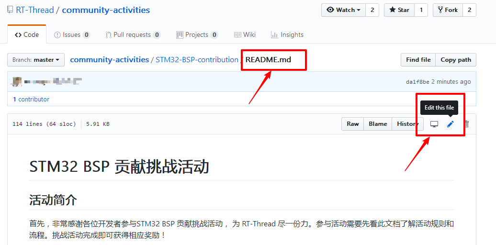
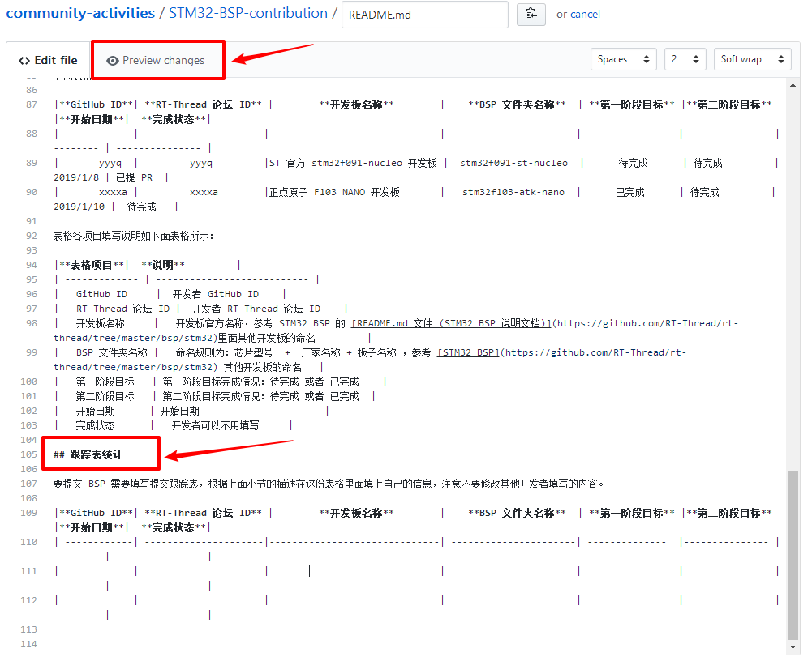
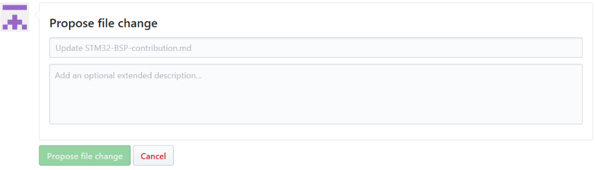

# Sensor 贡献挑战活动

## 活动简介

首先，非常感谢各位开发者参与 Sensor 贡献挑战活动， 为 RT-Thread 尽一份力。参与活动需要先看此文档了解活动规则和流程。挑战活动完成即可获得相应奖励！

## 活动目标

参与 Sensor 贡献挑战活动需要完成下面 2 个阶段的目标：

* 第一阶段：完成基础功能， 包括 `轮询模式读取数据` 和 `power on/off`的功能，以及常用控制命令（数据输出速率、测量范围）的支持，若传感器没有相应的功能则不用实现。 Sensor 的 README.md 文件需要填写第二阶段要完成的部分。

* 第二阶段：完成其他电源模式（`低功耗`、`高性能`）、`中断模式`、`FIFO 模式`以及`自检`功能的支持，若传感器没有相应的功能则不用实现。

## 活动规则

Sensor 贡献挑战活动规则如下：

* 贡献的 Sensor 不能和其他人重复，且 RT-Thread 仓库还没有支持此 Sensor。

* 参与活动必须填写跟踪表，方便跟踪每个人的进度。

* 第一阶段目标完成截止日期为一个周，逾期视为挑战失败。

* 第二阶段目标完成截止日期为两个周，逾期视为挑战失败。

* 第一阶段和第二阶段全部完成才算挑战成功！

## 活动奖励

挑战成功的小伙伴可以获得如下奖励：

<!-- * 可观看 RT-Thread 内部技术公开课（代码贡献专享）

* 可尝鲜获得 STM32 新品板卡，如 STM32G0、STM32WB

* 年底可参与 RT-Thread 年度杰出贡献奖评选

* RT-Thread 公司不定期福利

* 个人账号会被展示在 Github RT-Thread contributors -->

## 活动流程

活动的主要流程如下图所示：

### 选择未支持的传感器

* 查看 Sensor 的 [软件包索引仓库](https://github.com/RT-Thread/packages/tree/master/peripherals/sensors)，确认一下要做的 Sensor 是否已经支持，若已经支持，则不需要重复造轮子。

* 确认跟踪表里是否有此 Sensor，若已经有其他开发者在参与此 Sensor 的制作，那么只有在其他开发者挑战失败的情况下才可以参与此 Sensor 贡献挑战。

### 填写 Sensor 提交跟踪表

在本文跟踪表统计小节填写新增 Sensor 信息。可在 GitHub 仓库在线修改 README.md 文档。修改及提交步骤如下所示：

* 按下图所示点击编辑按钮修改文档。

* 然后在跟踪表章节新增自己的信息，填写完成可以点击 `Preview changes`查看预览效果，确认格式是否填写正确。

* 信息添加完成后填写提交信息并提交，比如“增加 ST 官方 hts221 传感器”等。

### fork RT-Thread 源代码仓库

参考文档《向 RT-Thread 贡献代码》，fork RT-Thread 源代码仓库，clone 自己的仓库到本地，并新建分支开发 Sensor。

### 根据指导文档制作 Sensor

参考 Sensor 的 [传感器驱动开发指南](https://www.rt-thread.org/document/site/development-guide/sensor/sensor_driver_development/) 的 Sensor 制作教程小节，根据此文件的详细步骤制作新的 Sensor。

### Sensor 完成提 Pull Request

Sensor 按照规范制作完成后推送到自己的 GitHub 仓库并提 PR，参考文档《向 RT-Thread 贡献代码》。

### 根据 review 意见更新 Sensor

GitHub 提 PR 后需要关注 PR 状态，相关的评审意见会在这里更新，根据评审意见及时修改 Sensor。

### PR merged

Sensor 修改完成，评审通过后才会被 merge。

## 跟踪表模板

下面表格为 Sensor 提交跟踪表模板：

|**GitHub ID**| **RT-Thread 论坛 ID** |        **传感器名称**        | **第一阶段目标** |**第二阶段目标** |**开始日期**|  **完成状态**|
| ------------| ---------------------|------------------------------| --------------  |--------------- | -------- | --------------- |
|       yyyq  |         yyyq         |ST 官方 hts221 传感器 |      待完成      | 待完成         | 2019/2/22 | 已提 PR  |
|       xxxxa |         xxxxa        |Bosch bma400 传感器       |      已完成      | 待完成         | 2019/1/22 |  待完成   |

表格各项目填写说明如下面表格所示：

|**表格项目**|  **说明**         |
| ------------- | --------------------------- |
|   GitHub ID     |  开发者 GitHub ID    |
|   RT-Thread 论坛 ID |  开发者 RT-Thread 论坛 ID    |
|   传感器名称     |   传感器官方名称，参考 Sensor 的[软件包索引仓库](https://github.com/RT-Thread/packages/tree/master/peripherals/sensors)里面其他传感器的命名         |
| 源文件名称 |   命名规则为：sensor  +  厂家名称 + 传感器名称 ，参考 [软件包仓库](https://github.com/RT-Thread-packages) 其他传感器源文件的命名   |
|   第一阶段目标   | 第一阶段目标完成情况：待完成 或者 已完成    |
|   第二阶段目标   | 第二阶段目标完成情况：待完成 或者 已完成  |
|   开始日期      | 开始日期                      |
|   完成状态      |   开发者可以不用填写     |

## 跟踪表统计

要提交 Sensor 需要填写提交跟踪表，根据上面小节的描述在这份表格里面填上自己的信息，注意不要修改其他开发者填写的内容。

| **GitHub ID** | **RTT论坛 ID** | **传感器名称** | **传感器文件夹名称** | **第一阶段目标** | **第二阶段目标** | **开始日期** | **完成状态** |
| ------------- | -------------- | -------------- | -------------------- | ---------------- | ---------------- | ------------ | ------------ |
|               |                |                |                      |                  |                  |              |              |
